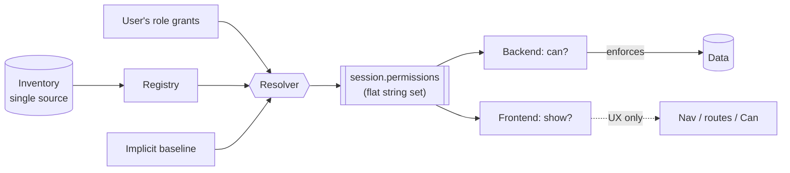
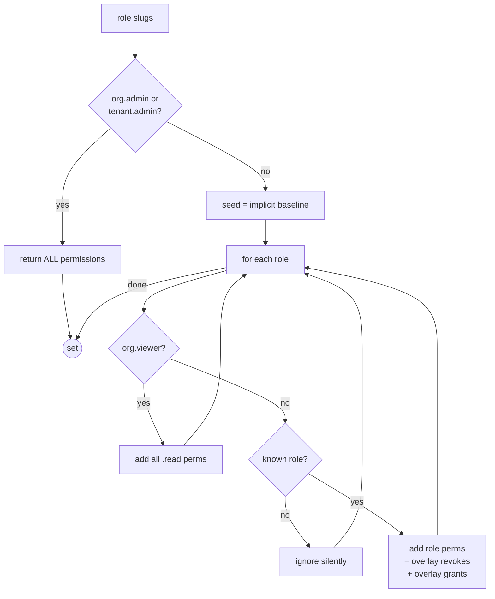
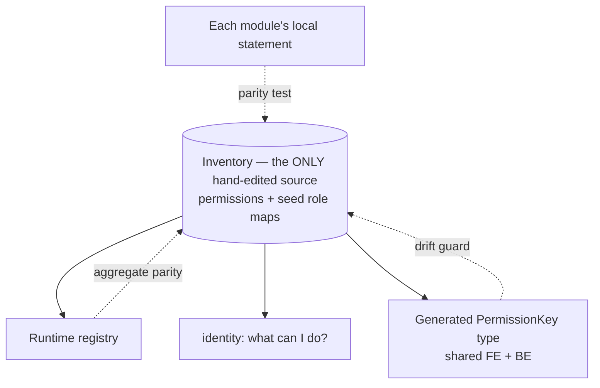
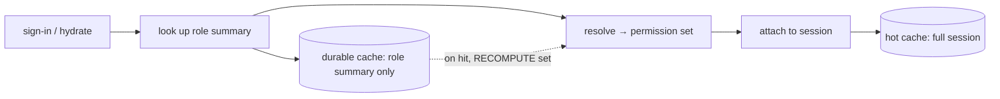
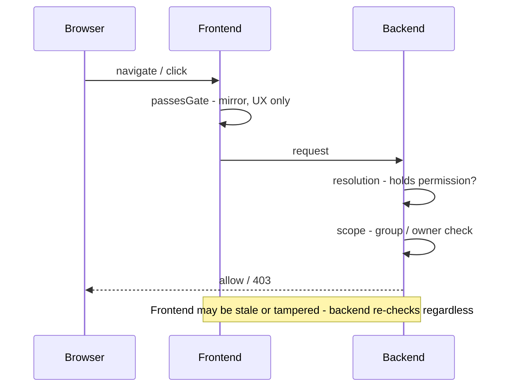

# How RBAC works

Role-based access control with a **precomputed permission set**. Users hold roles → roles grant permissions → at sign-in the resolver expands roles into one flat set on the session → every check is an O(1) membership test. The backend enforces; the frontend mirrors for UX only.

---

## Permission strings

Format: `module.resource.action` — a single flat string, e.g. `planner.task.create`.

| Segment | Meaning | Example |
|---|---|---|
| module | owning module (`core.*` is identity-owned) | `planner` |
| resource | noun acted on (may contain dots) | `workflow.run` |
| action | verb, optional scope suffix | `read`, `create` |

**Scope suffixes** are part of the string — distinct, independent permissions:

| Suffix | Means | Example |
|---|---|---|
| _(none)_ | the action | `knowledge.file.write` |
| `.self` | only your own objects | `agent.thread.read.self` |
| `.any` | anyone's objects | `identity.user.read.any` |
| `.tenant` / `.instance` | tenant-wide / one instance | `agent.workflow.run.read.tenant` |

> Authored grouped (`knowledge.file: [read, write, delete]`), checked flat (`knowledge.file.read`). The two are mechanically interconvertible and verified equal at build time.

---

## Role types

| Type | Resolves to | Example |
|---|---|---|
| **Module role** | its enumerated permission list | `knowledge.viewer` → file.read, search.read |
| **`org.admin` / `tenant.admin`** | **wildcard** — every permission that exists | (auto-covers new modules) |
| **`org.viewer`** | every string ending in `.read` | all reads, tenant-wide |
| **Implicit baseline** | fixed set for *every* authenticated user | chat use, own profile, own threads |

## Resolution algorithm

Consequences: union semantics (more roles only add) · unknown roles are no-ops (never crash) · wildcard is the only precedence · cost O(perms granted), in-memory.

---

## Single source of truth

Three derived consumers, all built from one inventory → cannot drift. Module-local declarations are **guarded mirrors**, not second sources.

**Build-time invariants** (fail-fast — refuse to boot/build if violated):

| Guard | Catches |
|---|---|
| no dangling grant | a role granting a non-existent permission |
| no duplicate key | two modules declaring the same permission |
| per-module parity | a module's statement drifting from inventory |
| aggregate parity | a module missing, or an orphan inventory entry |
| codegen drift | the generated type out of sync with inventory |

---

## Session lifecycle

The permission set is **computed, never persisted**. A deploy that changes permissions/role defaults takes effect immediately — no stale blobs to migrate. Recompute is O(roles).

---

## Enforcement: two independent layers (both must pass)

| Layer | Question | How |
|---|---|---|
| **Resolution** | "holds permission X at all?" | flat set membership — uniform everywhere |
| **Scope** | "is *this object* in reach?" | module-specific: group membership, ownership, self-vs-any |

**Fail-closed everywhere:**

| Situation | Result |
|---|---|
| missing / empty permission set | deny |
| unknown role slug | contributes nothing |
| RPC checker not wired at boot | throws (never silently passes) |
| frontend has no delivered set | hides everything |

---

## Actors

| Actor | Carries | Resolved how |
|---|---|---|
| Logged-in user | session permission set | at session build |
| Cross-service / RPC | **role slugs** (compact) on the wire | callee re-resolves with its own registry |
| Agent / LLM tool | actor's resolved set via request context | tool re-checks before executing — can't exceed the user |
| System / automation | synthetic session from a system role | same resolver rules; tenant isolation still enforced |

---

## `org.viewer` boundary (by design)

Rule is mechanical: ends in `.read`. So `...read.tenant` / `...read.instance` are **not** viewer-grade (they don't end in `.read`) — those operational reads need an explicit role. Deliberate trade: keep the resolver suffix-agnostic and dumb-fast.

## Overlay seam (future per-tenant role editing)

Resolver already accepts a per-tenant delta of `grant` / `revoke` per `(role, permission)`. Order: **defaults − revokes + grants**. Empty today (seed-only), so adding an admin matrix later is purely additive. Foundation roles are not customizable.

---

## Reasoning checklist

1. What exact permission string (incl. `.self`/`.any`/`.tenant`) does it need?
2. Does that string exist in the inventory? (else only wildcard admins have it)
3. Which roles grant it — and do wildcard / all-reads / implicit reach it?
4. Is there a **scope** dimension beyond the flat permission?
5. Is the path fail-closed?
6. Backend enforces for real; frontend only mirrors.
